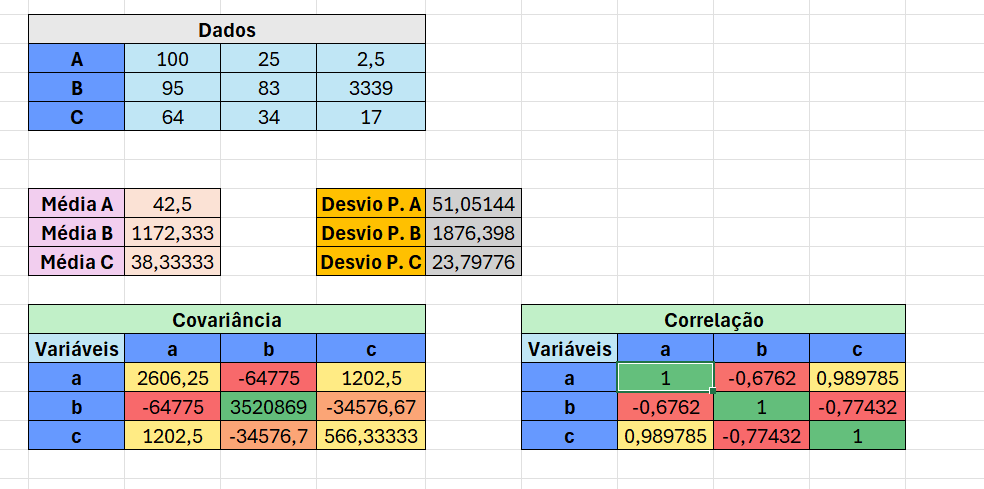
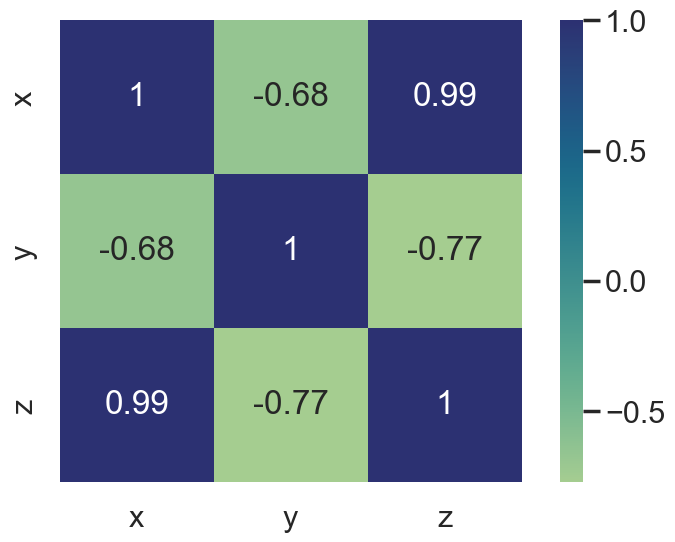

# [PT]:
# 📊 Análise de Correlação — Excel e Python

##  Descrição do Projeto
Este projeto foi desenvolvido como um **estudo pessoal sobre análise de correlação entre variáveis**, com o objetivo de compreender e aplicar conceitos estatísticos tanto no **Excel** quanto em **Python**. Se trata de um projeto pequeno mas com grande relevância para o meu desenvolvimento dentro da análise e ciência de dados. 

A proposta surgiu a partir de uma **matriz de dados** criada de forma aleatória onde foram calculadas **médias, desvios padrão, covariâncias e correlações** manualmente no Excel, e posteriormente reproduzidas e visualizadas em Python, utilizando o **Seaborn** para gerar o *heatmap* de correlação.

---

## Etapas do Projeto

### 1. Cálculos no Excel
- Cálculo da **média** e **desvio padrão** de cada variável;  
- Montagem da **matriz de covariância**;   
- Derivação da **matriz de correlação** a partir dos valores obtidos;  
- Visualização tabular dos resultados. 

As matrizes de covariância e correlação foram geradas a partir da formatação condicional do excel


 *Exemplo dos resultados no Excel:*  


---

### 2. Implementação em Python
O mesmo conjunto de dados foi utilizado em Python para:
- Calcular a correlação usando tanto a **biblioteca `statistics`** quanto a **fórmula matemática da correlação de Pearson** (sem uso direto de bibliotecas estatísticas);
- Comparar junto com um **heatmap de correlação** que foi criado com o **Seaborn** em outro código, permitindo visualizar a força e o sentido das relações entre as variáveis.

 *Exemplo do heatmap gerado (em outro código):*  


---

## Conceitos Envolvidos
- Média e desvio padrão amostral  
- Covariância entre variáveis  
- Correlação de Pearson  
- Visualização de dados (Seaborn / Matplotlib)  

---

## Tecnologias Utilizadas
- **Excel** (análise manual e tabelas)
- **Python 3.x**
  - `statistics`
  - `pandas`
  - `numpy`
  - `seaborn`
  - `matplotlib`

---

## Estrutura do Projeto
```
├── corr_mapheat.ipynb            # Notebook principal contendo o código em Python  
├── Correlação_heatmap.xlsx       # Planilha original utilizada na análise  
├── cmap.png                      # Heatmap de correlação gerado pelo Seaborn  
├── 7c8b4c57-615d-4290-ab4d-cf71d92c1d3c.png  # Captura de tela da planilha Excel  
└── README.md                     # Este arquivo  
```

---

## Objetivo de Aprendizado
Este projeto teve como propósito **reforçar o entendimento dos conceitos de correlação e covariância**, bem como **integrar o raciocínio matemático ao uso de ferramentas computacionais**.  
Foi uma oportunidade de praticar:
- raciocínio estatístico;  
- manipulação de dados;  
- visualização gráfica;  
- comparação entre cálculos manuais e computacionais.

---

## Próximos Passos
- Adicionar análise com `numpy.corrcoef()` e `pandas.DataFrame.corr()`;
- Expandir a base de dados para múltiplas variáveis;
- Incluir regressão linear simples para verificar dependência entre as variáveis. 
- Trabalhar com DataFrames maiores usando os conhecimentos obtidos nesse projeto. 

# [EN]:
# 📊 Correlation Analysis — Excel and Python

## Project Description
This project was developed as a **personal study on correlation analysis between variables**, aiming to understand and apply statistical concepts using both **Excel** and **Python**.  
It is a small project, but highly relevant to my development in **Data Analysis and Data Science**.

The work started from a **randomly generated data matrix**, where **means, standard deviations, covariances, and correlations** were manually calculated in Excel, and later reproduced and visualized in Python using **Seaborn** to generate a *correlation heatmap*.

---

## Project Stages

### 1. Calculations in Excel
- Calculation of **mean** and **standard deviation** for each variable;  
- Building the **covariance matrix**;  
- Deriving the **correlation matrix** from the obtained values;  
- Tabular visualization of results.  

The covariance and correlation matrices were generated using Excel's conditional formatting.

*Example of the Excel results:*  


---

### 2. Implementation in Python
The same dataset was used in Python to:
- Calculate correlations using both the **`statistics` library** and the **mathematical formula for Pearson correlation** (without directly relying on advanced statistical libraries);
- Compare results with a **correlation heatmap** created using **Seaborn** in another script, allowing visualization of the strength and direction of the relationships between variables.

 *Example of the generated heatmap (in a separate code):*  


---

## Concepts Covered
- Sample mean and standard deviation  
- Covariance between variables  
- Pearson correlation  
- Data visualization (Seaborn / Matplotlib)

---

## Tools and Technologies
- **Excel** (manual analysis and tables)  
- **Python 3.x**
  - `statistics`
  - `pandas`
  - `numpy`
  - `seaborn`
  - `matplotlib`

---

## Project Structure
```
├── corr_mapheat.ipynb            # Main notebook containing the Python code  
├── Correlação_heatmap.xlsx       # Original spreadsheet used in the analysis  
├── cmap.png                      # Correlation heatmap generated with Seaborn  
├── 7c8b4c57-615d-4290-ab4d-cf71d92c1d3c.png  # Screenshot of the Excel worksheet  
└── README.md                     # This file
```

---

## Learning Objective
This project aimed to **reinforce understanding of correlation and covariance concepts**, as well as **integrate mathematical reasoning with computational tools**.  
It was an opportunity to practice:
- Statistical reasoning;  
- Data manipulation;  
- Graphical visualization;  
- Comparison between manual and computational calculations.

---

## Next Steps
- Add analysis using `numpy.corrcoef()` and `pandas.DataFrame.corr()`;  
- Expand the dataset to include more variables;  
- Implement simple linear regression to test variable dependency;  
- Work with larger DataFrames applying the knowledge gained from this project.
